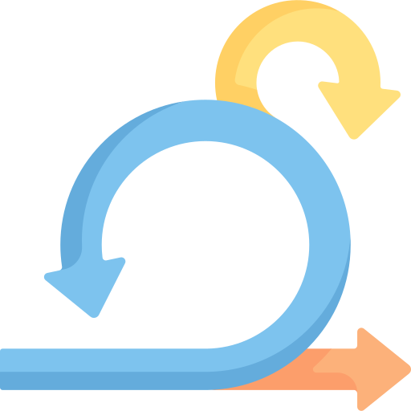

# Zwischengespräche

Während meiner Diplomarbeit werde ich anhand von Zwischengesprächen meine Zwischenziele überprüfen und somit erkennen, ob ich on track bin oder nicht. Diese werden im Rahmen der Diplomarbeit ebenfalls bewertet.

Während diesen Zwischengesprächen werden auch gleich die Shaping-Phasen 

{: width="250px" }

[Quelle](../Quellenverzeichnis/index.md#sprint)
